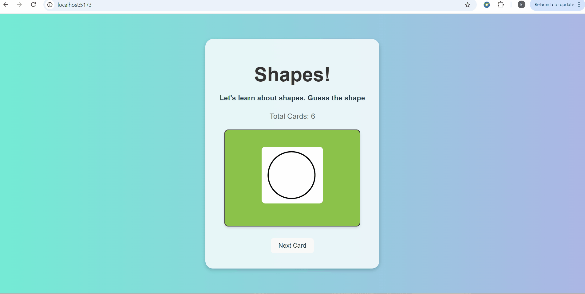

# Project 2 - *Flash Cards! Part1*

Submitted by: **Keerthi Kalyan Botu**

## Required Features

The following **required** functionality is completed:

* [ ] A single card at a time is displayed, only showing one of the components of the information pair
* [ ] Create a list of card pairs (an array of dictionaries where each dictionary contains the question and answer is perfectly fine)
* [ ] Clicking on the card shows the corresponding component of the information pair
* [ ] Clicking the next button displays a random new card

The following **stretch** functionality is completed:

* [ ] Cards contain images in addition to or in place of text
* [ ] Cards have different visual styles such as color based on their category

## Notes

In the video walkthrough, both sample website and localhost website are shown.

## Video Walkthrough

Here's a walkthrough of implemented features:

<!-- Replace this with whatever GIF tool you used! -->
GIF created with ...  
<!-- Recommended tools:
[Kap](https://getkap.co/) for macOS
[ScreenToGif](https://www.screentogif.com/) for Windows
[peek](https://github.com/phw/peek) for Linux. -->

## License

    Copyright [2025] [Keerthi Kalyan Botu]

    Licensed under the Apache License, Version 2.0 (the "License");
    you may not use this file except in compliance with the License.
    You may obtain a copy of the License at

        http://www.apache.org/licenses/LICENSE-2.0

    Unless required by applicable law or agreed to in writing, software
    distributed under the License is distributed on an "AS IS" BASIS,
    WITHOUT WARRANTIES OR CONDITIONS OF ANY KIND, either express or implied.
    See the License for the specific language governing permissions and
    limitations under the License.